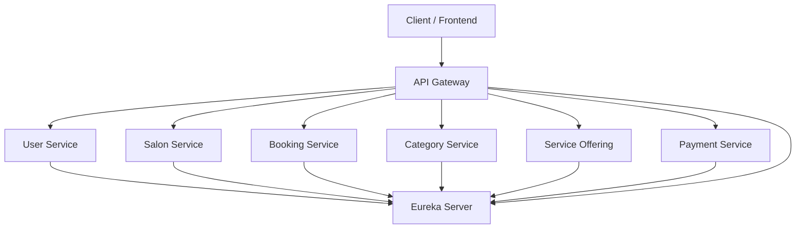
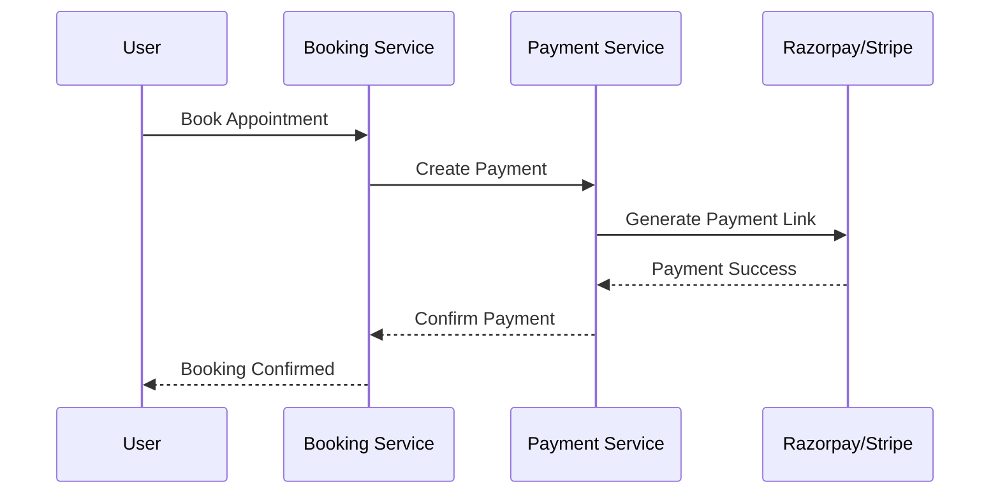

# 💇 Salon Booking Microservices Platform


<p align="center">


</p>

---

# 📖 Overview

Salon Booking is a **Spring Boot Microservices** application that enables users to discover salons, browse available services, book appointments, and securely process payments.

The application demonstrates a production-style distributed architecture using **Spring Cloud Gateway**, **Netflix Eureka**, **Spring Security**, **JWT Authentication**, and separate databases for each microservice.

---

# ✨ Features

### 👤 User Service

- User Registration
- Secure Login
- JWT Authentication
- Role Based Authorization

### 💇 Salon Service

- Register Salons
- Manage Salon Details
- Search Salons
- View Available Services

### 📅 Booking Service

- Book Appointments
- Cancel Bookings
- Booking History
- Slot Management

### 💳 Payment Service

- Razorpay Integration
- Stripe Integration
- Payment Verification
- Transaction Management

### ☁️ Microservices

- Netflix Eureka
- Spring Cloud Gateway
- Independent Databases
- REST Communication
- Scalable Architecture

---

# 🏗️ System Architecture



---

# 📦 Microservices

| Service | Port | Description |
|----------|------|-------------|
| Eureka Server | 8070 | Service Discovery |
| Gateway Server | 8087 | API Gateway |
| User Service | - | User Authentication |
| Salon Service | - | Salon Management |
| Booking Service | - | Appointment Booking |
| Category Service | - | Service Categories |
| Service Offering | - | Salon Services |
| Payment Service | - | Razorpay & Stripe |

---

# 🛠 Tech Stack

| Category | Technology |
|------------|------------|
| Language | Java 21 |
| Framework | Spring Boot 3.5.16 |
| Cloud | Spring Cloud 2025.0.0 |
| Discovery | Netflix Eureka |
| Gateway | Spring Cloud Gateway |
| Security | Spring Security + JWT |
| Database | MySQL |
| ORM | Spring Data JPA |
| Payment | Razorpay & Stripe |
| Build Tool | Maven |
| Utilities | Lombok |

---

# 📂 Project Structure

```text
Salon-Booking-Project
│
├── booking-service
├── category-service
├── eureka-server
├── gateway-server
├── payment-service
├── salon-service
├── service-offering
└── user-service
```

---

# 🚀 Getting Started

## Clone Repository

```bash
git clone https://github.com/Akashsingh47304/Salon-Booking-project.git

cd Salon-Booking-project
```

---

## Create Databases

```sql
CREATE DATABASE user_service;
CREATE DATABASE salon_service;
CREATE DATABASE booking_service;
CREATE DATABASE category_service;
CREATE DATABASE service_offering;
CREATE DATABASE payment_service;
```

---

## Configure Database

```yaml
spring:
  datasource:
    url: jdbc:mysql://localhost:3306/database_name
    username: root
    password: your_password

  jpa:
    hibernate:
      ddl-auto: update
```

---

## Start Services

Run services in the following order:

1. Eureka Server
2. Gateway Server
3. User Service
4. Salon Service
5. Category Service
6. Service Offering
7. Booking Service
8. Payment Service

---

# 🌐 API Gateway Routes

Base URL

```
http://localhost:8087
```

| Route | Service |
|--------|----------|
| /api/users/** | User Service |
| /api/salons/** | Salon Service |
| /api/booking/** | Booking Service |
| /api/categories/** | Category Service |
| /api/serviceoffering/** | Service Offering |
| /api/payments/** | Payment Service |

---

# 💳 Payment Flow



---

# 🔍 Eureka Dashboard

```
http://localhost:8070
```

Use the Eureka Dashboard to monitor all registered microservices.

---

# 📸 Screenshots

- Home Page
- Salon Listing
- Booking Screen
- Payment Screen
- Eureka Dashboard

---

# 🛣 Future Enhancements

- Docker
- OpenFeign
- RabbitMQ
- Redis Caching
- Circuit Breaker
- Keycloak Authentication
- Kubernetes
- CI/CD Pipeline
- AWS Deployment

---

# 🤝 Contributing

1. Fork the repository
2. Create a feature branch

```bash
git checkout -b feature/your-feature
```

3. Commit changes

```bash
git commit -m "Add new feature"
```

4. Push branch

```bash
git push origin feature/your-feature
```

5. Open a Pull Request

---

# 👨‍💻 Author

**Akash Singh**

GitHub: **Akashsingh47304**

---

# ⭐ Support

If you like this project, consider giving it a ⭐ on GitHub.
